# Provision an Autonomous AI Database

## Introduction

This workshop runs on **Oracle Autonomous AI Database 26ai** with Oracle APEX 26.1. In this lab you create
that database in your own tenancy and open an APEX workspace inside it.

Two things you set here are used much later, so do them deliberately rather than clicking through: the
**database version**, which every AI feature in this workshop depends on, and the **ADMIN password**, which
Lab 7 needs in order to grant your workspace schema the privileges it uses.

> **Already have an Autonomous AI Database 26ai with APEX 26.1?** Skip to Task 3 and create a workspace in
> it. You can check the APEX version from the workspace home page footer.

Estimated Time: 15 minutes

### Objectives

In this lab, you will:

* Create an Autonomous AI Database on version 26ai
* Open APEX and sign in as the instance administrator
* Create the workspace you build in for the rest of the workshop

### Prerequisites

This lab assumes you have:

* An Oracle Cloud account — a [free trial](https://signup.cloud.oracle.com) is enough
* Permission to create an Autonomous AI Database in a compartment of that tenancy

## Task 1: Create the Autonomous AI Database

1. Sign in to the OCI Console. From the navigation menu, choose **Oracle AI Database**, then
   **Autonomous AI Database**.

    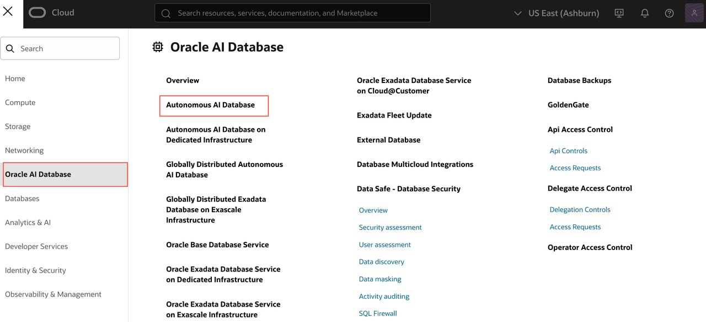

2. Check the **compartment** selector on the left before you go further. A fresh tenancy defaults to the
   root compartment; if you were given a specific compartment, switch to it now, otherwise the list may
   show nothing or return a permissions error.

3. Click **Create Autonomous AI Database**.

    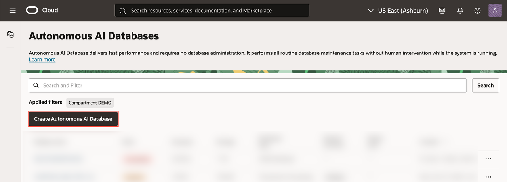

4. Enter and select the following:

    * Display name and database name: anything you like — `HELPDESK` is used in this workshop
    * Workload type: **Transaction Processing**
    * **Database version: `26ai`**
    * Always Free: toggle **ON** if it is offered — see the note below if it is not
    * Administrator password: choose one you will remember, and **write it down now**

    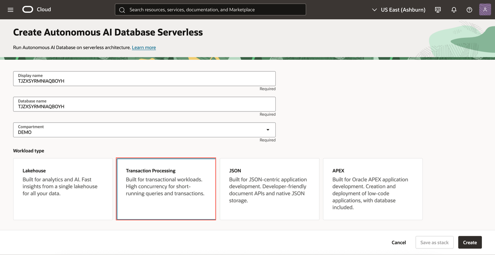

    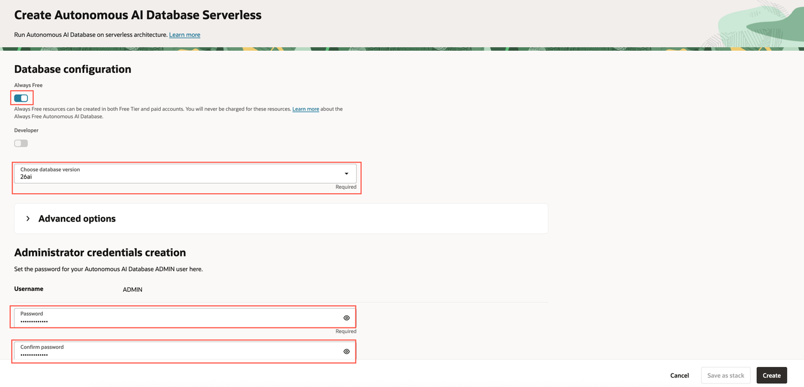

    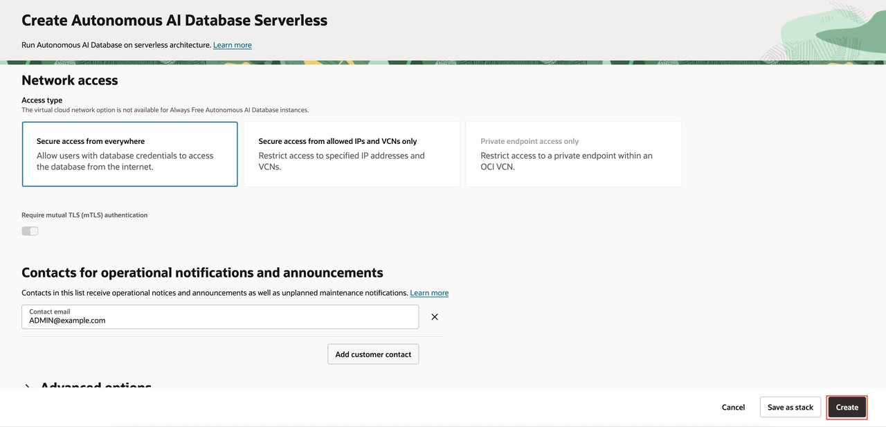

    > **⚠️ The version selector defaults to `19c`, and that silently breaks this workshop.** AI Interactive
    > Reports, the AI Agent, and in-database vector search all need **26ai**. A 19c database provisions
    > perfectly happily and then fails several labs in with errors that never mention the version. Change
    > it before you click Create.

    > **⚠️ Keep the ADMIN password.** Lab 7 signs in to Database Actions as `ADMIN` to grant your workspace
    > schema two privileges. That is the only place it is needed — but there is no way to continue Lab 7
    > without it, and resetting it means a detour through the console.

    > **Always Free greyed out, or refused with a capacity message?** That is common and nothing to fix.
    > Always Free can only be created in your tenancy's **home region**, and individual regions run out of
    > Always Free capacity (`adb-free-count=0`). **Leave Always Free OFF and continue** — a trial or paid
    > instance is identical for this workshop's purposes.

    > **Which region?** Any. Your database does not have to sit in a region that offers OCI Generative AI —
    > APEX calls that service over REST, so the two are independent. Lab 1 covers the region requirement
    > for Generative AI itself.

5. Click **Create Autonomous AI Database**. Provisioning takes a few minutes.

6. Wait for the state to change from **Provisioning** to **Available** before continuing.

    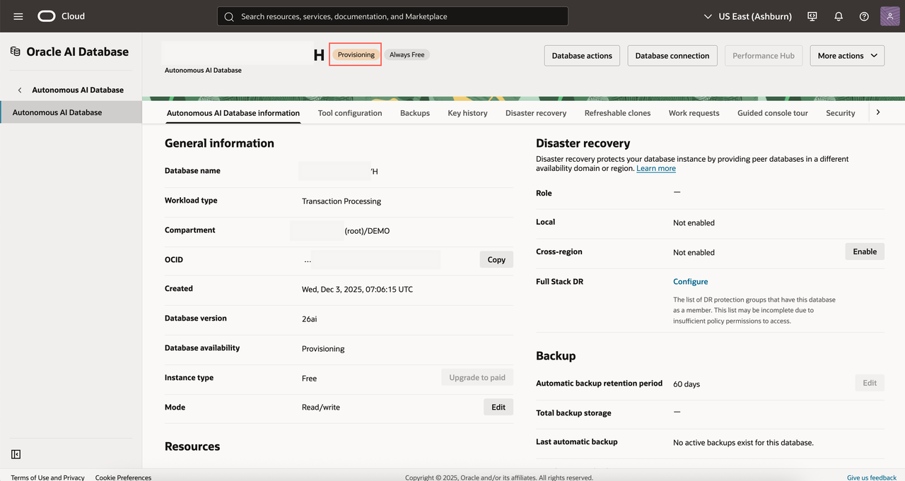

    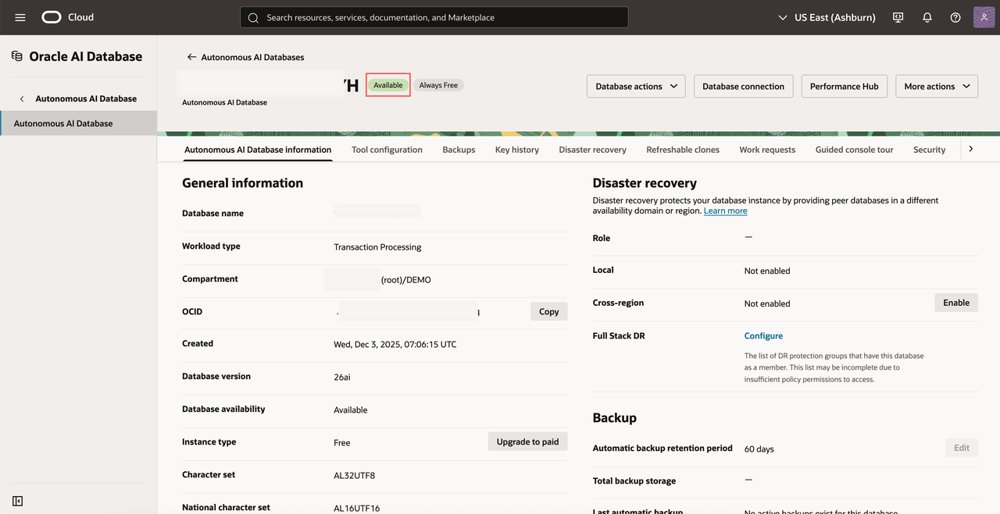

## Task 2: Open APEX and Sign In as Instance Administrator

APEX ships with the database but has no workspace yet, so your first visit is as the instance
administrator.

1. On the database details page, open the **Tool configuration** tab. Under **Oracle APEX**, copy the
   public access URL and open it in a new browser tab.

    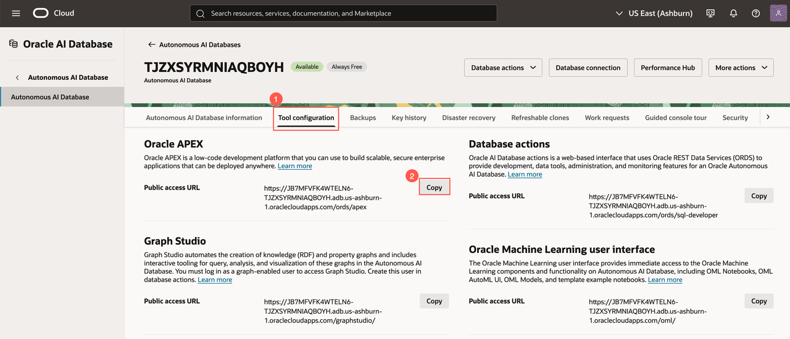

2. Sign in to **Administration Services** with the **ADMIN** password you set in Task 1.

    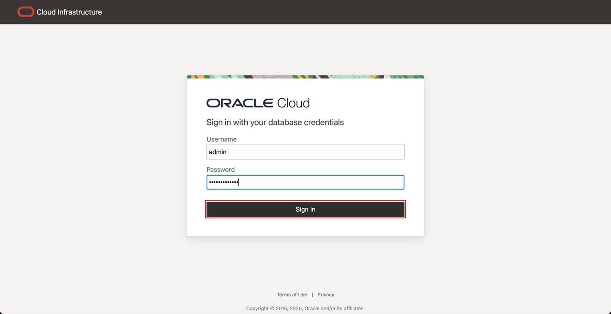

## Task 3: Create Your Workspace

1. Click **Create Workspace**.

    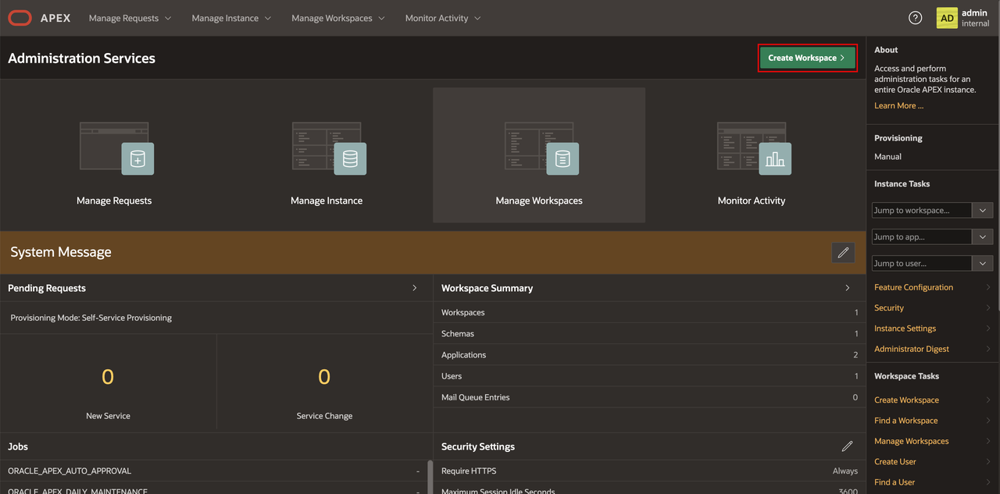

2. Choose **New Schema** — the workshop creates its own tables, so there is nothing to reuse.

    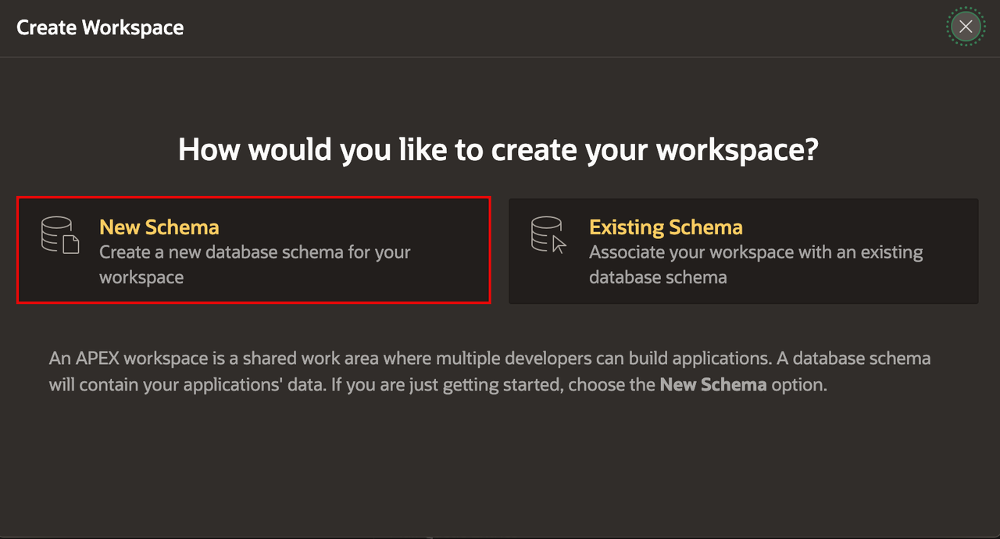

3. Enter a workspace name, username and password. `HELPDESK` is used throughout this workshop; any name
   works as long as you remember it.

    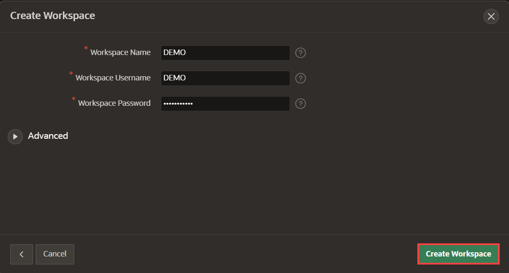

    > **Your schema name will not match your workspace name.** Autonomous AI Database prefixes new APEX
    > schemas with `WKSP_`, so a workspace called `HELPDESK` runs on schema **`WKSP_HELPDESK`**. Nothing in
    > this workshop schema-qualifies anything, so it simply works — but Lab 7 asks you to type the schema
    > name, and that prefixed form is the one it wants. SQL Workshop shows it in the header.

4. Click the workspace name in the success message to leave Administration Services.

    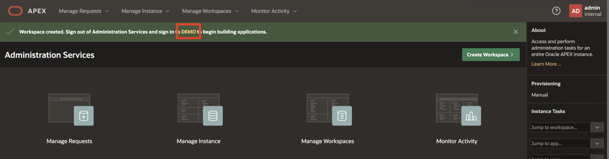

5. Sign in to your new workspace with the username and password you just set.

    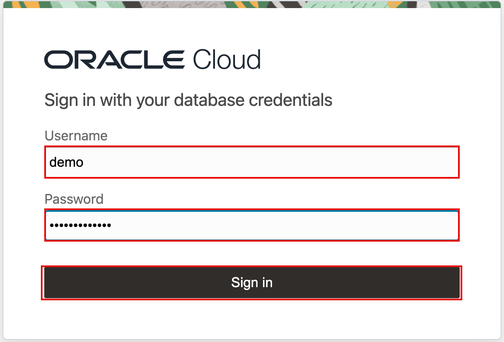

You now have an Autonomous AI Database 26ai running APEX 26.1 with an empty workspace — everything the
rest of the workshop builds on.

You may now **proceed to the next lab**.

## Learn More

* [Provisioning Autonomous AI Database](https://docs.oracle.com/en-us/iaas/autonomous-database-serverless/doc/autonomous-provision.html)
* [Oracle APEX Release Notes, Release 26.1](https://docs.oracle.com/en/database/oracle/apex/26.1/htmrn/index.html)

## Acknowledgements

* **Author** - Rick Houlihan
* **Last Updated By/Date** - Rick Houlihan, August 2026
